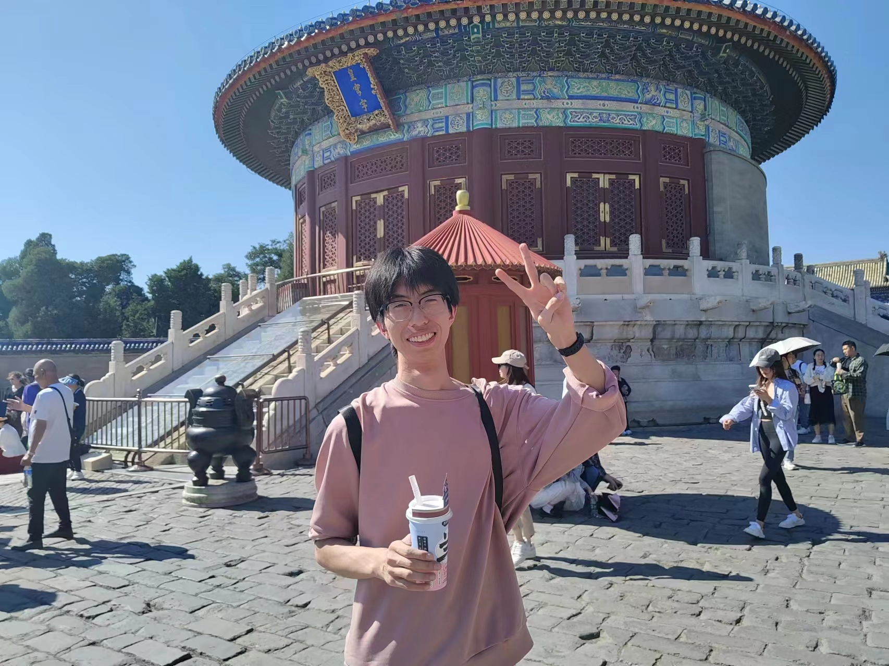

<h1 align="center">Hi, I'm Boheng Xie!</h1>

### About Me

<em>
<h6>天大本科-智算学部动画专业</h6>

喜欢coding,目前做前端

</em>

### Things I am currently working on

- [个人简历](./profile.md "简历")
- 准备毕业
- 学习新知识

### Portfolio

- [About 前端开发](https://mildclimate.github.io/Mildclimate/pages/softE.html)
- [About 动画制作](https://mildclimate.github.io/Mildclimate/pages/animation.html)
- [About 日常思考](https://mildclimate.github.io/Mildclimate/pages/normal.html)

### What I want to do next

- 前端开发
- 游戏与动画
- 绘画

---

#### Skills:

#### Components:

